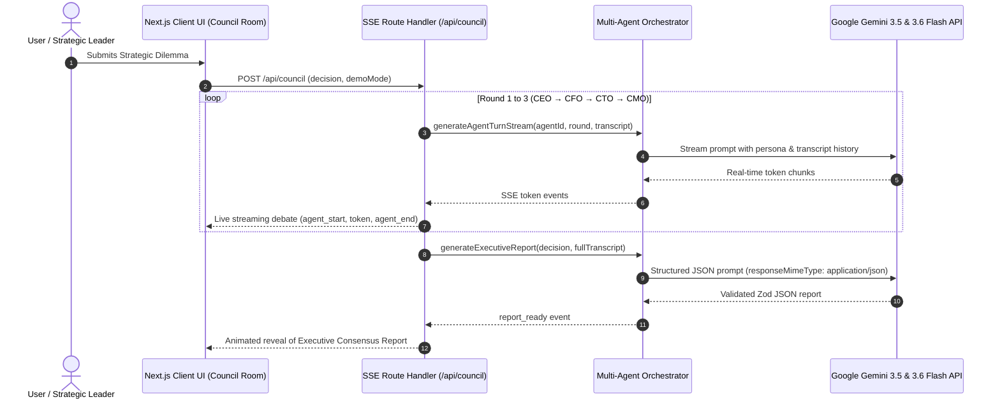

# 🏛️ CouncilAI — Multi-Agent Executive Decision Simulator

> **AI for Strategic Governance & Executive Decision Assistance**  
> *Transforming high-stakes corporate deliberation into 60 seconds of AI boardroom clarity.*

---

## 🎯 Problem Statement
Founders, CEOs, and executive leaders face complex, high-stakes decisions every day—such as pivoting pricing models, scaling infrastructure, expanding to new markets, or altering business strategies. 

However, consulting human executive boards (CEOs, CFOs, CTOs, CMOs) or external management consultants is **prohibitively expensive**, **slow** (taking weeks of deliberation), and prone to cognitive bias. Existing AI tools provide generic single-prompt responses that lack domain-specific pushback, multi-perspective debate, or structured consensus.

---

## 💡 Proposed Solution & Innovation
**CouncilAI** solves this problem by deploying an autonomous **Multi-Agent C-Suite Boardroom**:
* 👑 **Victoria Vance (CEO):** Category dominance, aggressive market share expansion, and vision.
* 💰 **Arthur Sterling (CFO):** Capital efficiency, cash burn, risk mitigation, and mandatory unit economics math chains $(\text{signups} \times \text{conversion} \times \text{price})$.
* ⚡ **Dr. Elena Rostova (CTO):** System architecture, technical debt, developer bandwidth, and security.
* 📢 **Marcus Thorne (CMO):** Customer perception, viral loops, NPS, and retention.
* 🏛️ **Boardroom Moderator:** Neutral synthesizer generating structured executive consensus reports.

---

## ⚖️ The 5 Implemented Boardroom Debate Rules

CouncilAI enforces strict behavioral guardrails across all 3 debate rounds:
1. **Original Proposal Stance (Round 3):** Every executive MUST declare their verdict (**Support / Oppose / Conditional**) on the *original proposal* first before offering any alternative compromise.
2. **Data-Driven Concessions:** Agents will **never** concede or alter positions unless presented with new empirical data, explicitly naming who and what changed their mind.
3. **Metric Assumption Labeling:** All unverified numbers, percentages, or dollar metrics cited by agents are transparently tagged with `(assumption)` and kept internally consistent across turns.
4. **CFO Mandatory Math Chain:** The CFO MUST state the explicit math chain ($\text{signups} \times \text{conversion} \times \text{price}$) before concluding.
5. **Guaranteed Round 3 Dissent:** At least one executive maintains an **Oppose** or **Conditional** stance in Round 3 to prevent uncritical groupthink.

---

## 🤖 Generative AI Architecture & Integration

CouncilAI is powered by the **Google Gemini API** (`@google/generative-ai` & `@google/genai` SDKs):



---

## 🔒 Security, Safety & Privacy

CouncilAI implements defense-in-depth security:
* **Enterprise Security Headers:** Configured in `next.config.ts` (`Strict-Transport-Security`, `X-Frame-Options: DENY`, `X-Content-Type-Options: nosniff`, `Referrer-Policy`, `X-XSS-Protection`, `Permissions-Policy`).
* **Input Sanitization & Length Caps:** API endpoint `/api/council` sanitizes HTML/script tags and enforces strict 3–1000 character length boundaries.
* **API Key Protection:** Zero hardcoded API keys; keys are managed via server-side environment variables (`GEMINI_API_KEYS`).
* **Resilient Key Rotation & Failover:** Middleware automatically rotates keys and falls back across candidate models (`gemini-3.5-flash`, `gemini-3.6-flash`) with seamless zero-crash demo mode fallbacks.

---

## 🧪 Testing & Quality Assurance

Comprehensive unit and integration test suite powered by **Vitest**:
```bash
# Run automated test suite
npm test
```
* `__tests__/schema.test.ts`: Zod schema validation for Executive Report.
* `__tests__/agents.test.ts`: Agent system prompts & mandatory debate rule integrity.
* `__tests__/demoScript.test.ts`: Replay message consistency & round structure.
* `__tests__/utils.test.ts`: Utility styling merge function.

---

## 🚀 Quickstart & Setup

### Prerequisites
* Node.js v18+
* npm / pnpm / yarn

### 1. Installation
```bash
npm install
```

### 2. Environment Configuration
Create a `.env.local` file:
```env
GEMINI_API_KEY=your_gemini_api_key_here
GEMINI_MODEL=gemini-3.5-flash
```

### 3. Run Development Server
```bash
npm run dev
```
Open [http://localhost:3000](http://localhost:3000) in your browser.

---

## 🛠️ Tech Stack

* **Framework:** Next.js 16 (App Router) + TypeScript
* **Styling:** Tailwind CSS + Custom Glassmorphism System (Light Theme)
* **Animations:** Framer Motion
* **AI Engine:** Google Gemini API (`gemini-3.5-flash`, `gemini-3.6-flash`)
* **State Management:** Zustand
* **Schema Validation:** Zod
* **Test Runner:** Vitest
* **Icons & Rendering:** Lucide React, React Markdown
