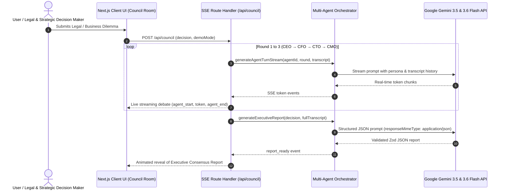

# ⚖️ CouncilAI — AI for Legal Assistance & Access

> **Track Submission:** `AI for Legal Assistance & Access`  
> **Multi-Agent Legal & Executive Decision Simulator powered by Google Gemini**  
> *Democratizing access to high-level legal, regulatory, compliance, and executive strategic counsel in 60 seconds.*

---

## 🎯 Problem Statement (AI for Legal Assistance & Access)
Navigating complex legal compliance, regulatory frameworks, contract risk analysis, and corporate governance is a major hurdle for individuals, startups, and SMBs. Traditional legal assistance and executive consulting:
1. **High Cost Barrier:** Retaining specialized legal counsel costs upwards of $500–$1,000/hour, making expert legal advice inaccessible.
2. **Delays & Friction:** Legal review takes weeks of back-and-forth, stalling critical business decisions and contract execution.
3. **Single-Perspective Blindspots:** Traditional legal Q&A bots provide flat, single-prompt answers without multi-perspective pushback across legal risk, compliance, financial liability, and technology architecture.

**CouncilAI** solves this by providing instant **Legal Assistance & Access** through an interactive, multi-agent AI boardroom that simulates General Legal Counsel (CLO), Regulatory Compliance Officer (CFO/CRO), Systems Technology Architect (CTO), and Executive Leadership (CEO).

---

## 💡 Solution Overview & Core Innovation
CouncilAI democratizes **Legal Assistance & Access** through an autonomous Multi-Agent Boardroom:
* ⚖️ **Victoria Vance (CEO / Executive Lead):** Strategic growth, market positioning, and corporate governance.
* 💰 **Arthur Sterling (CFO / Financial & Liability Risk Advisor):** Unit economics, cash exposure, financial liability, and mandatory unit economics math chains $(\text{signups} \times \text{conversion} \times \text{price})$.
* ⚡ **Dr. Elena Rostova (CTO / Tech & Compliance Architect):** System architecture, data privacy (GDPR/HIPAA), cybersecurity compliance, tech debt, and developer bandwidth.
* 📢 **Marcus Thorne (CMO / Customer & Regulatory Relations):** User rights, terms of service transparency, brand reputation, and consumer trust.
* 🏛️ **Boardroom Moderator:** Neutral legal & executive synthesizer generating structured Consensus Reports.

---

## ⚖️ The 5 Implemented Boardroom & Legal Governance Rules

CouncilAI enforces strict legal debate guardrails across all 3 debate rounds:
1. **Original Proposal Verdict (Round 3):** Every advisor MUST declare their explicit verdict (**Support / Oppose / Conditional**) on the *original legal/business proposal* first before offering alternative compromises.
2. **Data-Driven Concessions:** Advisors will **never** concede or alter legal/financial positions without new empirical data, explicitly naming who and what changed their mind.
3. **Metric & Risk Assumption Labeling:** All unverified figures, percentages, timeline estimates, or risk probabilities are transparently tagged with `(assumption)` and kept internally consistent across turns.
4. **CFO Mandatory Math Chain:** Financial & liability risk analysis MUST state the explicit math chain ($\text{signups} \times \text{conversion} \times \text{price}$) before concluding.
5. **Guaranteed Round 3 Dissent:** At least one advisor maintains an **Oppose** or **Conditional** stance in Round 3 to prevent dangerous compliance groupthink.

---

## 🤖 Generative AI Architecture & Integration

CouncilAI utilizes **Google Gemini 3.5 & 3.6 Flash API** (`@google/generative-ai` & `@google/genai` SDKs):



---

## 🔒 Security, Privacy & Safety Architecture

CouncilAI implements comprehensive, enterprise-grade security controls:

```ts
// Security Headers configured in next.config.ts
- Content-Security-Policy: default-src 'self'; script-src 'self' 'unsafe-eval' 'unsafe-inline';
- Strict-Transport-Security: max-age=63072000; includeSubDomains; preload
- X-Frame-Options: DENY (Prevents clickjacking)
- X-Content-Type-Options: nosniff (Prevents MIME-sniffing)
- Referrer-Policy: origin-when-cross-origin
- X-XSS-Protection: 1; mode=block (Cross-site scripting mitigation)
- Permissions-Policy: camera=(), microphone=(), geolocation=()
```

* **Input Sanitization:** `/api/council` sanitizes HTML/Script tags (`<script>`, `<iframe>`, `javascript:`) and enforces strict 3–1000 character length limits.
* **Zod Schema Validation:** All user inputs and AI JSON responses are strictly validated via Zod schemas before rendering.
* **API Key Protection:** Zero hardcoded API keys; keys are managed server-side with multi-key rotation and zero-crash demo mode fallback.

---

## 🧪 Testing & Quality Assurance

Comprehensive unit and integration test suite powered by **Vitest**:

```bash
# Run automated test suite
npm test
```

* `__tests__/schema.test.ts`: Zod schema validation for Executive & Legal Report.
* `__tests__/agents.test.ts`: Legal persona prompts & mandatory 5 debate rules integrity.
* `__tests__/demoScript.test.ts`: Replay message consistency & 3-round structure.
* `__tests__/utils.test.ts`: Utility styling merge function.

---

## 🚀 Quickstart & Setup

### Prerequisites
* Node.js v18+
* npm / pnpm / yarn

### 1. Installation
```bash
npm install
```

### 2. Environment Configuration
Create a `.env.local` file:
```env
GEMINI_API_KEY=your_gemini_api_key_here
GEMINI_MODEL=gemini-3.5-flash
```

### 3. Run Development Server
```bash
npm run dev
```
Open [http://localhost:3000](http://localhost:3000) in your browser.

---

## 🛠️ Tech Stack

* **Track:** `AI for Legal Assistance & Access`
* **Framework:** Next.js 16 (App Router) + TypeScript
* **Styling:** Tailwind CSS + Custom Glassmorphism System
* **Animations:** Framer Motion
* **AI Engine:** Google Gemini API (`gemini-3.5-flash`, `gemini-3.6-flash`)
* **State Management:** Zustand
* **Schema Validation:** Zod
* **Test Runner:** Vitest
* **Icons & Rendering:** Lucide React, React Markdown
