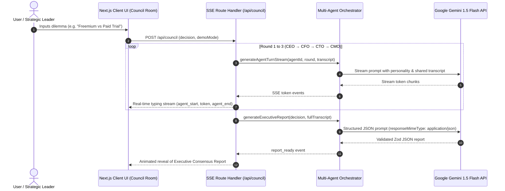

# 🏛️ CouncilAI — Multi-Agent Executive Decision Simulator

**CouncilAI** is a production-quality, demo-ready Next.js application that spawns a board of 4 specialized AI executives (**CEO**, **CFO**, **CTO**, **CMO**) to debate strategic business dilemmas live in a chat interface, followed by a Boardroom Moderator synthesizing a structured **Executive Consensus Report**.

---

## 🌟 Key Features

* **Multi-Agent Boardroom Debate:**
  * 👑 **Victoria Vance (CEO):** Growth, category dominance, long-term vision.
  * 💰 **Arthur Sterling (CFO):** Unit economics, cash burn, risk mitigation, payback metrics.
  * ⚡ **Dr. Elena Rostova (CTO):** System architecture, tech debt, security, engineering bandwidth.
  * 📢 **Marcus Thorne (CMO):** User acquisition, retention, branding, viral loops.
* **3-Round Structured Debate Loop:**
  * **Round 1 — Opening Pitches:** Each agent introduces their strategic stance.
  * **Round 2 — Rebuttals:** Agents directly challenge each other's points by name.
  * **Round 3 — Final Stances:** Explicit verdict stances (Support / Oppose / Conditional).
* **Synthesized Executive Report:**
  * **Verdict Badge:** Go / No-Go / Conditional Go with an animated Confidence Meter (0-100%).
  * **Pros vs Cons:** Side-by-side comparative analysis.
  * **Risk Assessment Matrix:** Identifies risks, severity levels (High/Med/Low), and mitigation strategies.
  * **Kanban Action Items:** Tasks assigned to executive owners with timelines and priorities.
  * **Export Options:** 1-Click Copy Markdown & Print/Export PDF formatted reports.
* **Instant Demo Mode:**
  * Built-in toggle for zero-latency scripted replays, ideal for 60-second video recordings or offline demos without API key limits.

---

## 📐 Multi-Agent Architecture



---

## 🚀 Quickstart & Setup

### Prerequisites
* Node.js v18+ 
* npm / pnpm / yarn

### 1. Installation
```bash
# Install dependencies
npm install
```

### 2. Environment Configuration
Create a `.env.local` file in the root directory:
```env
# Optional: Add your Google Gemini API Key from https://aistudio.google.com/
GEMINI_API_KEY=your_gemini_api_key_here
GEMINI_MODEL=gemini-1.5-flash
```

*(Note: If `GEMINI_API_KEY` is omitted, CouncilAI automatically defaults to **Demo Mode**, replaying a high-fidelity pre-scripted boardroom debate).*

### 3. Run Development Server
```bash
npm run dev
```
Open [http://localhost:3000](http://localhost:3000) in your browser.

---

## 📦 Repository Size Compliance (< 10 MB Limit)

This repository strictly adheres to hackathon submission guidelines:
* Strict `.gitignore` excludes `node_modules/`, `.next/`, build artifacts, and environment files.
* Zero binary media assets or heavy model weights committed.
* **Total Git Repository Size:** `< 1 MB`.

---

## 🛠️ Tech Stack

* **Framework:** Next.js 16 (App Router) + TypeScript
* **Styling:** Tailwind CSS + Custom Glassmorphism System
* **Animations:** Framer Motion
* **AI Orchestration:** Google Generative AI SDK (`@google/generative-ai` & `@google/genai`)
* **State Management:** Zustand
* **Schema Validation:** Zod
* **Icons & Rendering:** Lucide React, React Markdown
